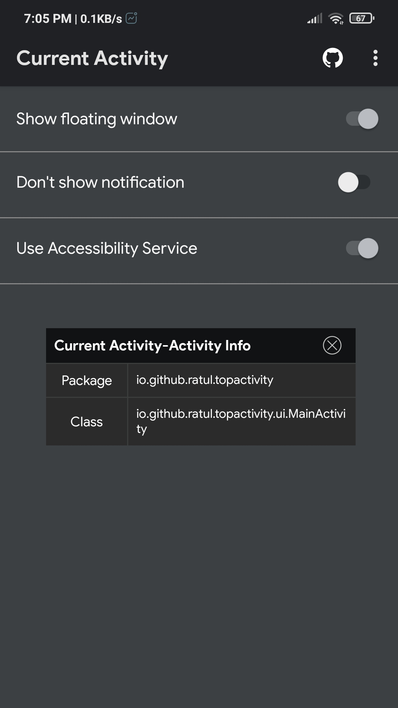
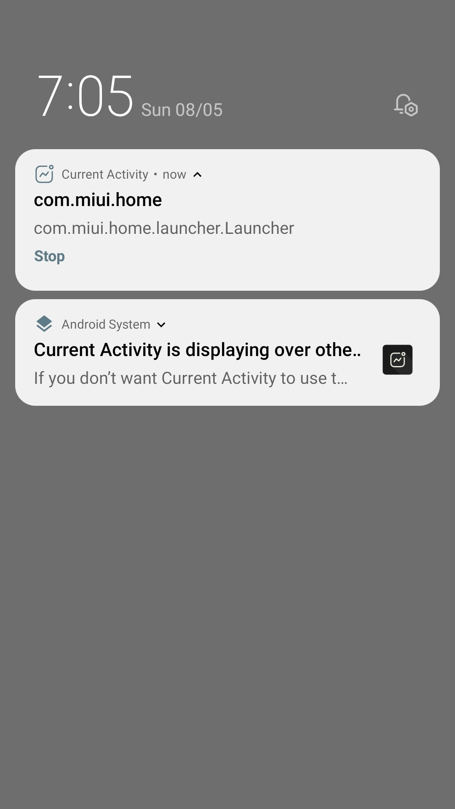

  

<h1 align="center">
  <b>Current Activity</b>
</h1>

An useful tool for Android Developers &amp; Reversers, which shows the package name and class name of current activity which you are in

   

[![Maintenance](https://img.shields.io/badge/Maintained-Yes-green?logo=data:image/svg+xml;base64,PHN2ZyBpZD0iQ2FwYV8xIiBlbmFibGUtYmFja2dyb3VuZD0ibmV3IDAgMCA1MTIuMjYgNTEyLjI2IiBoZWlnaHQ9IjUxMiIgdmlld0JveD0iMCAwIDUxMi4yNiA1MTIuMjYiIHdpZHRoPSI1MTIiIHhtbG5zPSJodHRwOi8vd3d3LnczLm9yZy8yMDAwL3N2ZyI+PGcgZmlsbD0iI0ZGRkZGRiI+PHBhdGggZD0ibTM3MC4xMTkgMjgwLjYzNS0zNC4xMzkgMzQuMTM5LTM0LjE3NS0zNC4xNzUgODEuOTk2LTgxLjk5NmM5LjAxNCAyLjUzOCAxOC4yMTYgMy43NzkgMjcuMzY2IDMuNzc4IDI2LjMyOS0uMDAyIDUyLjE3OS0xMC4yODkgNzEuNDkxLTI5LjYwMSAyOC40MDctMjguNDA3IDM3LjI4OC03MC45NDggMjIuNjI2LTEwOC4zNzhsLTguMzYyLTIxLjM0OC01My42NjcgNTMuNjY4LTIxLjY2OS01LjgwNy01LjgwNy0yMS42NyA1My42NjYtNTMuNjY3LTIxLjM0NS04LjM2MWMtMzcuNDI3LTE0LjY2LTc5Ljk2OS01Ljc4LTEwOC4zNzggMjIuNjI3LTI2LjAyMyAyNi4wMjMtMzUuNjYgNjMuOTA2LTI1LjgyMiA5OC44NTZsLTgxLjk5NiA4MS45OTYtMTEwLjEwOS0xMTAuMTA5IDI5LjIxMy0yOS4yMTItOTAuNTQ1LTcxLjM2OS02MC40NjMgNjAuNDYyIDcxLjM2OCA5MC41NDYgMjkuMjE0LTI5LjIxMyAxMTAuMTA5IDExMC4xMDktNzIuMzg0IDcyLjM4NGMtMzcuNTkyLTExLjc3Ni03OC42MDUtMS45MzgtMTA2LjkgMjYuMzU3LTIwLjA5MyAyMC4wOTMtMzEuMTU5IDQ2LjgwOC0zMS4xNTkgNzUuMjIzczExLjA2NiA1NS4xMyAzMS4xNTkgNzUuMjIzYzIwLjczOSAyMC43MzkgNDcuOTggMzEuMTA4IDc1LjIyMyAzMS4xMDggMjcuMjQyIDAgNTQuNDg0LTEwLjM2OSA3NS4yMjMtMzEuMTA4IDI4LjI5NS0yOC4yOTUgMzguMTMzLTY5LjMwOSAyNi4zNTctMTA2LjlsNzIuMzg0LTcyLjM4NCAzNC4xNzUgMzQuMTc1LTM0LjEzOSAzNC4xMzkgMTIzLjU5MyAxMjMuNTkzYzExLjk1MiAxMS45NTIgMjcuODQzIDE4LjUzNCA0NC43NDYgMTguNTM0IDE2LjkwMiAwIDMyLjc5My02LjU4MiA0NC43NDUtMTguNTM0IDI0LjY3Mi0yNC42NzMgMjQuNjcyLTY0LjgxNyAwLTg5LjQ5em0tMzMwLjA1Ni0yMTcuODAyIDIyLjc2NS0yMi43NjUgNDMuMDkzIDMzLjk2Ny0zMS44OTEgMzEuODkxem0zMDguNTQ2IDczLjU4NC0zLjU4LTkuMTM5Yy0xMC4zMTMtMjYuMzI2LTQuMDctNTYuMjQ1IDE1LjkwNi03Ni4yMjIgMTMuODU5LTEzLjg1OCAzMi40OTctMjEuMTAzIDUxLjQxMi0yMC44MDVsLTMwLjAyOCAzMC4wMjkgMTQuNzcyIDU1LjEyOSA1NS4xMyAxNC43NzMgMzAuMDI3LTMwLjAyOGMuMzAzIDE4LjkxLTYuOTQ2IDM3LjU1NC0yMC44MDQgNTEuNDEyLTE5Ljk3NyAxOS45NzUtNDkuODk1IDI2LjIyLTc2LjIyMiAxNS45MDVsLTkuMTM4LTMuNTc5LTk1LjQ5MiA5NS40OTItMjcuNDc2LTI3LjQ3NnptLTE3NS41MDggMjMwLjQ2IDMuOTE4IDkuMjk4YzEyLjEyNiAyOC43NzQgNS42OTYgNjEuNjMyLTE2LjM4IDgzLjcwOC0xNC44OTMgMTQuODkyLTM0LjQ0OCAyMi4zMzctNTQuMDEgMjIuMzM1LTE5LjU1Ny0uMDAxLTM5LjEyMS03LjQ0Ni01NC4wMS0yMi4zMzUtMTQuNDI2LTE0LjQyNy0yMi4zNzItMzMuNjA3LTIyLjM3Mi01NC4wMXM3Ljk0NS0zOS41ODMgMjIuMzcyLTU0LjAxYzE0LjY3LTE0LjY2OSAzNC4wOTQtMjIuNDI5IDUzLjkyMy0yMi40MjkgMTAuMDEyIDAgMjAuMTMgMS45OCAyOS43ODQgNi4wNDlsOS4yOTggMy45MTggODYuMjc5LTg2LjI3OSAyNy40NzYgMjcuNDc2em0xOTcuMDE4LTQzLjgxNyAyNy40NzcgMjcuNDc3LTQ3LjA2NCA0Ny4wNjQtMjcuNDc2LTI3LjQ3NnptMTAyLjM4MiAxNDkuNDQ3Yy02LjI4NiA2LjI4NS0xNC42NDMgOS43NDctMjMuNTMyIDkuNzQ3cy0xNy4yNDctMy40NjItMjMuNTMyLTkuNzQ3bC01My42OTItNTMuNjkyIDQ3LjA2NC00Ny4wNjQgNTMuNjkyIDUzLjY5MmMxMi45NzUgMTIuOTc1IDEyLjk3NSAzNC4wODggMCA0Ny4wNjR6Ii8+PHBhdGggZD0ibTEwNi42MjkgMzU2LjQ0NGMtMTMuMjAzIDAtMjUuNjE2IDUuMTQyLTM0Ljk1MSAxNC40NzgtOS4zMzYgOS4zMzYtMTQuNDc4IDIxLjc0OC0xNC40NzggMzQuOTUxczUuMTQyIDI1LjYxNSAxNC40NzcgMzQuOTUxYzkuMzM2IDkuMzM2IDIxLjc0OSAxNC40NzggMzQuOTUyIDE0LjQ3OHMyNS42MTUtNS4xNDIgMzQuOTUyLTE0LjQ3OGMxOS4yNzEtMTkuMjcyIDE5LjI3MS01MC42MzEgMC02OS45MDItOS4zMzYtOS4zMzYtMjEuNzQ5LTE0LjQ3OC0zNC45NTItMTQuNDc4em0xMy43MzkgNjMuMTY3Yy0zLjY3IDMuNjY5LTguNTQ5IDUuNjktMTMuNzM4IDUuNjktNS4xOSAwLTEwLjA2OC0yLjAyMS0xMy43MzgtNS42OS0zLjY2OS0zLjY3LTUuNjktOC41NDktNS42OS0xMy43MzhzMi4wMjEtMTAuMDY4IDUuNjkxLTEzLjczOGMzLjY2OS0zLjY3IDguNTQ4LTUuNjkgMTMuNzM4LTUuNjkgNS4xODkgMCAxMC4wNjggMi4wMjEgMTMuNzM4IDUuNjkgNy41NzMgNy41NzUgNy41NzMgMTkuOTAxLS4wMDEgMjcuNDc2eiIvPjwvZz48L3N2Zz4=)](https://github.com/ratsan/Current-Activity/graphs/commit-activity)
[![Contributions](https://img.shields.io/badge/Contributions-Open-yellow?logo=data:image/png;base64,iVBORw0KGgoAAAANSUhEUgAAAEAAAABACAYAAACqaXHeAAAAAXNSR0IArs4c6QAAAARzQklUCAgICHwIZIgAAARqSURBVHic7ZvNa11FGMZ/bxJjPzQNpoKi0WoXRaogrS26MfYDxWq14KaCuHIhooJu1H9AxU0RFaQgRYugoESMaDVKExBUrNKNsSVImraCVG1rrYoN8rg4701OT+bcxJsz5yTmPBDuzDvvzH3myXzPXKhRo0aNRQybyUGSAb3ApfHpFIoTwHEzUzOnXAEkLQWeBB4GriyWW2k4BrwK7DKzv0IOQQEkrQQ+Am6Kx61UfA3caWa/ZhOmCeBN/jNgk5tGgJeBI8BEPI6F4gJgFfAYcJ3bBs3s9hlzStqhKbwraUk8nnEhaYmk/lR9ts8m01vufFLSJSXwjApJPZJOeZ3ezKa3BfI0msyQmZ2MSy8+vN8Pe3RtNj0kQJd//haLVAU45Z8rsgkhARYVagGqJlA1agGqJlA1OpqkrZf0fGlM4mJ9XkIzAW7wv/81mglwDvijLCKRsRzonJWnpDFfNu6Jy6k8SNrjdRrLpi36QbAWoGoCVaMWoGoCMLlnr4RL5QJIupfkBPfDKr6/cgGAB0h4TDusKAOVCuAHsLd59PMqOEQVQFKbpDVe0RCuB1Z6eH8m71VlHMhGE8DJDwCHgOdy3DalwpMCSLoPGAcOSLo8FkeIJIDfKr0PbHPTxTmuDQGOm9loyt44l1wLDEm6oniWOZjrXkDSMkmDqbP4YUkXBfzaJP3iPm9k0kzSS6kyxiRdM4c6lbMXkLScpNlvddMwcJeZnQ243wj0ePi8/u8Xmo8DL7ppFbBf0rVF8oUCBfDKfwBsdtM+kvu4UOUhp/834CI8Aexy09UkIqwuhnEOWukCfgX1RarJDki6cIY8A3nNMuD7Qqrso5L+0211GV1gA3Czh08DD5rZ300IdQC3enTafz+Ap4CDHu4FdrTIcxqKEuBLYNDD3UB/aOBLYR1TI/1Qs4J9j7CbZMwAOAy83TLTDAoRwMwmgO0kUx9AH/CxpK6cLOn+P5RXrqR24DXgITcdBjab2c9zItwMc5kGJXXq/OvoAwrcMEva5+mjoXLcp13S66myRtTioqjZGBByblkAz9+p5F1BA99I6kmld0g642m7c8pol7Q3VcZBSS2/USpjEJyEmZ0DdgLvuGkd8GzKZSNTK8O8AfARkl0iwLfAlljNPspS2MeE+4G9bhpPJc+m/x8B/iEZXLeG3vZEw1y7QKC8rkz8Uy//+xnydfsgWASH3C7Q7GKkEJjZmRSRTuAWjzad/83sdExeDZR9ILIBWObh2SyAoiN6C8jgBPAncJaphVOlKFUAMxuV1AtMmNnvZX53HspuAcy3l2fz4VS4UtQCBGyNaau7TCKR0diPTHv7GBJgxD/70mv4hQolL9/7PPrdbDLck9qE9GthP5ZeKum9VH3uzvrkPZcfBLa46RDwCvADC+u5/GrgUWCN2z4xszuyjnk/mOghuazcGIthyfgK2BaagoOzgO+++oBngKNxuUXFOPA00Je3/pjxR1MASm5mLiuQWBn4ycx+rJpEjRo1asxr/As8TL5578cVOwAAAABJRU5ErkJggg==)](https://github.com/ratsan/Current-Activity/pulls)

 

<h1 align="left">
  <b>&nbsp;How it works</b>
</h1>
It uses accessibility service api and package usage stats to monitor app activity changes and show it in a freely moveable popup window

<h1 align="left">
  <b>&nbsp;Screenshots</b>
</h1>

<h1 align="left">
  <b>&nbsp;Credits</b>
</h1>

* [Wen](https://github.com/109021017) for [project base](https://github.com/109021017/android-TopActivity).
* [Muhtaseem Al Mahmud](https://github.com/KingMahmud) for project optimization.

<h1 align="left">
  <b>&nbsp;License</b>
</h1>

  
Current Activity is licensed under [GNU General Public License](https://www.gnu.org/licenses/gpl-3.0.html) v3 or later.

---
