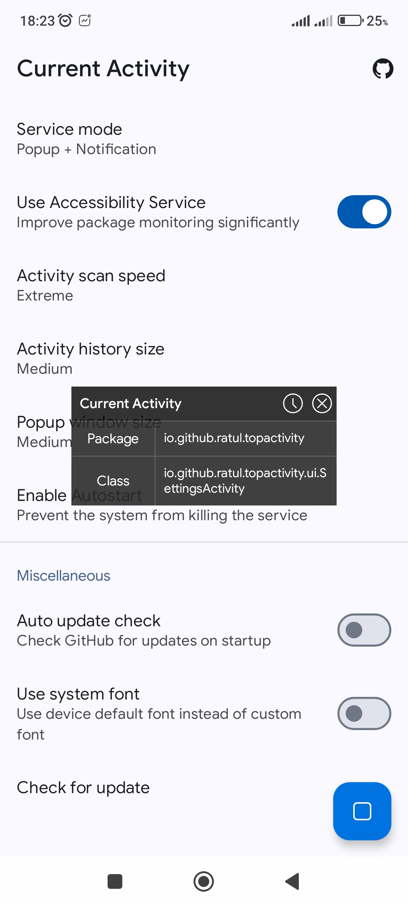
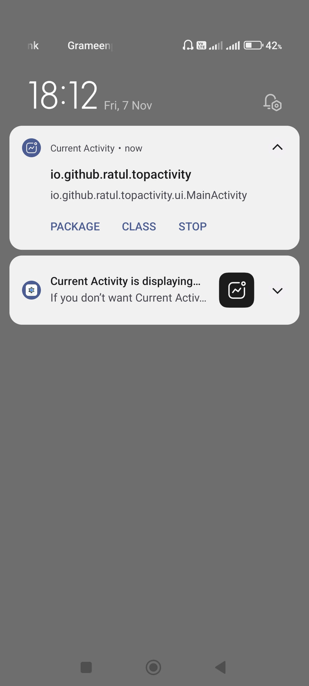
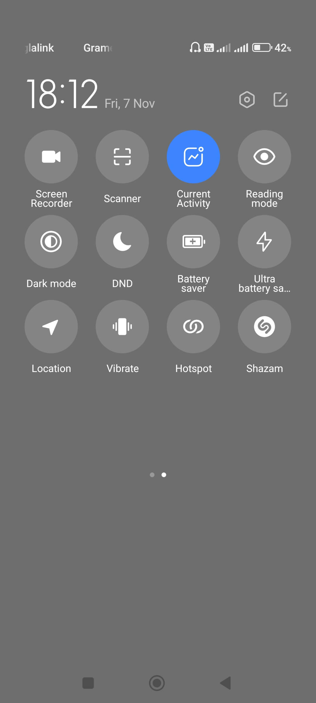
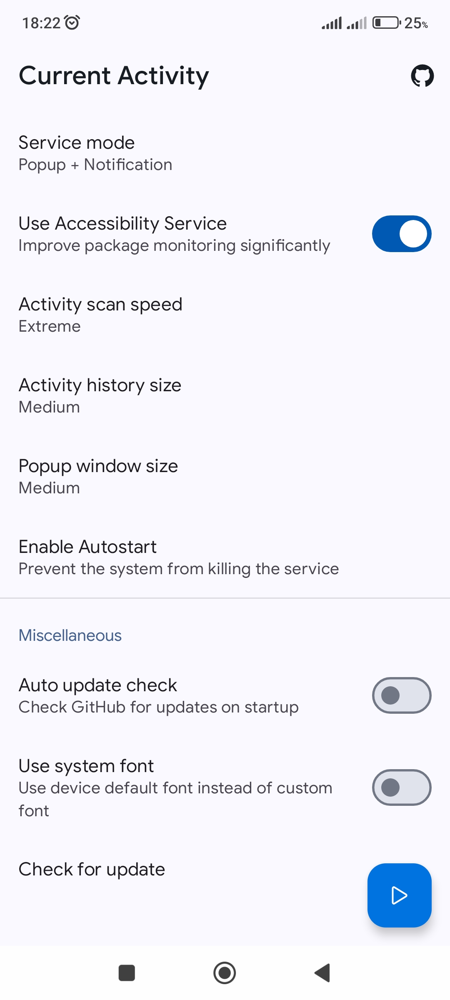

  

  # Current Activity

  **🔍 App Activity Inspector: Real-Time Foreground Status Monitor**

  An essential tool for **Android Developers** and **Reverse Engineers**  
  Instantly displays the *package name* and *class name* of the application currently in the foreground.  
  Quickly inspect any active app on your device for development or debugging.

  
  
  

  
  
  
<!--   -->

## ⚠️ Important Note

> **Note:** Google prohibits the usage of **QUERY_ALL_PACKAGES** permission and **AccessibilityService** without a strong explanation. For that reason, the Play Store version of **Current Activity** won't have either of these features. While the app will still function, performance will vary. 
> 
> **💡 Recommendation:** It is strongly recommended to use the latest **Global** version from [**Releases**](https://github.com/codehasan/Current-Activity/releases/latest) rather than from **Play Store**.

## ✨ Key Features

- **📱 Real-Time Tracking:** View the **package name** and the **class name** of the app currently visible to the user (i.e., the top app).
- **🛠️ Development & Debugging:** Quickly verify which components are launched, aid in deep-link development, and confirm third-party app interaction.
- **🔧 Reverse Engineering:** Identify key components and packages in external applications for analysis.

## ⚙️ How It Works

The monitoring is made possible with two main services: **PackageMonitoringService** and **AccessibilityMonitoringService**.

1. **PackageMonitoringService** actively checks for app state changes in the last 10 seconds, doing this every 500ms. Each time a state change is detected and confirmed to be in foreground, the popup window is updated to inform the user.

2. **AccessibilityMonitoringService** complements **PackageMonitoringService** by actively observing window state changes. If a change is detected and confirmed not to be a System class (e.g., `android.view.View`), it immediately updates the popup window.

## 📸 Screenshots

  
  
  
  
  

## 🤝 Contributing

Contributions are what makes the open-source community such an amazing place to learn, inspire, and create. Any contributions you make are **greatly appreciated**.

If you have a suggestion that would make this better, please fork the repo and create a pull request. You can also simply open an issue with the tag "enhancement".
Don't forget to give this project a star! Thanks again!

1. Fork the project
2. Create your feature branch. (`git checkout -b feature/AmazingFeature`)
3. Commit your changes. (`git commit -m 'Add some AmazingFeature'`)
4. Push to the branch. (`git push origin feature/AmazingFeature`)
5. Open a pull request.

## 💡 FAQs

### Unable to enable AccessibilityService for Current Activity?

Click to expand for the answer

 

1. Make sure you are using the global version, and not the version from Play Store.
* **Solution:** Download global version from [Releases](https://github.com/codehasan/Current-Activity/releases/latest)
2. In Chinese roms, sideloaded third party apps are initially restricted from using AccessibilityService.
* **Solution:** Watch this video in [YouTube](https://youtube.com/shorts/3mw_3TIF0y4)

**Still having issues?** Please [open an issue here](https://github.com/codehasan/Current-Activity/issues) and include a screen recording or screenshot of the problem.

---

### Unable to install Current Activity?

Click to expand for the answer

 

1. If you can't install from Play Store, download and install from GitHub.
* **Solution:** Download global version from [Releases](https://github.com/codehasan/Current-Activity/releases/latest)
2. If installation is [blocked by Play Protect](./.resources/images/blocked_by_play_protect.jpg),
    1. Open Play Store
    2. Click on your account icon or menu icon and find Play Protect
    3. Open settings in Play Protect and disable all the options

**Still having issues?** Please [open an issue here](https://github.com/codehasan/Current-Activity/issues) and include a screen recording or screenshot of the problem.

---

### AccessibilityService auto disabled or not working?

Click to expand for the answer

 

Some Chinese phones like Xiaomi are known to disable AccessibilityServices automatically.
  1. Check to see if there is an option called `Use Autostart` in Current Activity (Added in v2.0.0)
  2. Click on `Enable`
  3. Find **Current Activity** and enable
  4. If you don't see this option, please update to the latest global version from [Releases](https://github.com/codehasan/Current-Activity/releases/latest)

Watch these videos for more help,
* Newer versions of Xiaomi - [YouTube](https://youtube.com/shorts/0zE2uj5-Dcg)
* Older versions of Xiaomi - [YouTube](https://youtube.com/shorts/DeBkBQnUH9A)

**Still having issues?** Please [open an issue here](https://github.com/codehasan/Current-Activity/issues) and include a screen recording or screenshot of the problem.

## 🙏 Credits

- [**Wen**](https://github.com/109021017) for [core resources](https://github.com/109021017/android-TopActivity)
- [**Muhtaseem Al Mahmud**](https://github.com/KingMahmud) for project optimization

## 📄 License

  

  Current Activity is licensed under [**GNU General Public License v3.0**](https://www.gnu.org/licenses/gpl-3.0.html) or later.

